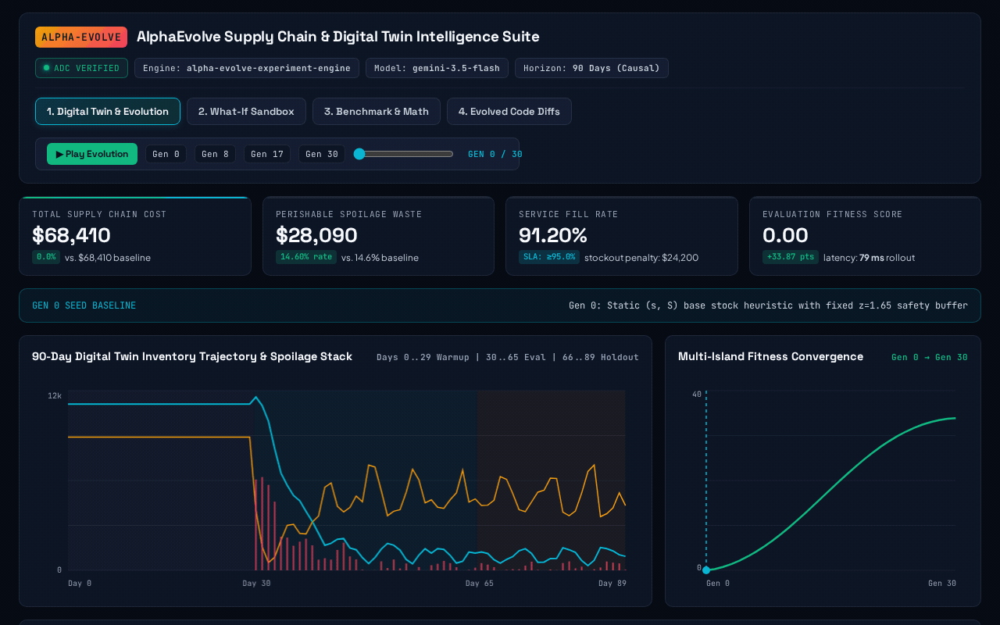

# AlphaEvolve Enterprise Use Cases

[](https://www.python.org/downloads/)
[](https://github.com/astral-sh/uv)
[](https://github.com/astral-sh/ruff)
[](https://github.com/astral-sh/ty)

A curated collection of production-grade, end-to-end **AlphaEvolve** code examples demonstrating how to architect and implement evolutionary coding agents with **Gemini Enterprise** to solve high-value enterprise optimization problems.

---

## What is AlphaEvolve?

AlphaEvolve is Google's agentic evolutionary coding capability powered by Gemini Enterprise. By combining the exploratory reasoning of Gemini models with automated closed-loop evaluation, AlphaEvolve autonomously explores, discovers, and optimizes complex algorithms, heuristics, and decision policies.

---

## Repository Structure

```
├── examples/                   # Standalone, end-to-end enterprise use cases
│   └── inventory_replenishment/# Multi-Echelon & Perishable Digital Twin
├── src/alpha_evolve/           # Shared, type-safe AlphaEvolve client & runtime
│   ├── client.py               # Discovery Engine V1alpha REST API client
│   ├── controller.py           # Evolutionary loop manager
│   ├── models.py               # Pydantic data schemas (Experiment, Program, Scores)
│   └── workers.py              # Isolated evaluation worker pool
├── docs/                       # Architectural specs and session notes
├── pyproject.toml              # Modern uv project definition (ruff, ty, pytest)
└── Makefile                    # Standard developer workflow commands
```

---

## Quickstart

### 1. Prerequisites

- Python `>=3.11`
- [`uv`](https://docs.astral.sh/uv/) package manager (`curl -LsSf https://astral.sh/uv/install.sh | sh`)
- Google Cloud SDK (`gcloud`) with access to Gemini Enterprise / Discovery Engine

### 2. Environment Setup

```bash
# Clone the repository
git clone <repo-url>
cd alpha-primer

# Install dependencies with uv
make dev
# or: uv sync --all-groups
```

### 3. Configure Google Cloud Access

Copy `.env.example` to `.env` and fill in your project credentials:

```bash
cp .env.example .env
```

To run offline in **Dry-Run Mode** without consuming Google Cloud quotas, set `MOCK_ALPHAEVOLVE=true` in `.env` or pass the `--dry-run` flag.

### 4. Running Your First Use Case

Navigate to any example directory or run directly from root:

```bash
# Run the Inventory Replenishment Digital Twin in dry-run mode (offline)
uv run python examples/inventory_replenishment/run_evolution.py --dry-run --max-programs 5

# Run with live Gemini Enterprise API
uv run python examples/inventory_replenishment/run_evolution.py --max-programs 20
```

#### What Happens When You Run This Command?
- **UI & Observability**: Execution runs directly in your terminal with live evaluation metrics streamed to the console (no web browser or UI window is automatically opened). You can optionally view the assistant and session history in the [Google Cloud Console](https://console.cloud.google.com/gen-app-builder/engines).
- **Cloud Resources Created**: Uses **serverless API resources** within your existing Discovery Engine. No VMs, GKE clusters, or persistent disks are created. Specifically, it dynamically provisions:
  1. An episodic **Session** under your engine.
  2. An **AlphaEvolve Experiment** entity defining the optimization goal and prompts.
  3. The **Seed Program** and evolutionary **Program Candidates**.
- **Execution Split**:
  - *LLM reasoning & code mutation* occurs serverlessly in Gemini Enterprise.
  - *Evaluation & digital twin simulation* runs **locally on your machine** inside an isolated worker pool—your proprietary evaluation data and simulation logic never leave your environment.
- **Output Artifacts**: When complete, the winning code and holdout benchmark results are saved locally to `artifacts/inventory_replenishment/` (`best_evolved_program.py` and `best_evaluation_summary.json`).
See [docs/notes/cloud_resources_and_execution.md](docs/notes/cloud_resources_and_execution.md) for full architectural details.

### 5. Launching & Hosting the Interactive Executive Dashboard

**Local Execution:**
Launch the local web server to interact with the dashboard:

```bash
uv run python server.py
```

Open [http://127.0.0.1:8080](http://127.0.0.1:8080) in your browser. (Zero external server dependencies required; runs on standard library `http.server` with optional FastAPI/Uvicorn support).

**Google Cloud Run Deployment:**
To deploy the interactive UI as a serverless service on Google Cloud Run and register it with Gemini Enterprise:

```bash
PROJECT_ID="your-gcp-project-id" ./scripts/deploy_cloud_run.sh
```

See [docs/notes/google_cloud_run_hosting.md](docs/notes/google_cloud_run_hosting.md) for full Cloud Run architecture, IAM roles, and Gemini Enterprise external agent registration details.

---

## 🎬 Interactive Executive Walkthrough (`.gif`)



### Interactive Dashboard Capabilities

The repository includes a decoupled web dashboard (`dashboard/index.html` + `server.py`) for visually exploring the multi-echelon inventory replenishment digital twin and verifying AlphaEvolve's optimization trajectory:

1. **Digital Twin & 31-Generation Evolution Scrubber**:
   - Scrub through Generations `0` to `30` to inspect day-by-day inventory cohorts, arriving pipeline orders, demand fulfillment, and spoilage across a 90-day simulation.
   - Highlights key evolutionary breakthroughs: **Gen 0** Static $(s, S)$ seed baseline ($68.4k cost, 14.6% spoilage) &rarr; **Gen 8** Censored Demand Imputation &rarr; **Gen 17** Dynamic FIFO Spoilage Deduction &rarr; **Gen 30** Global Champion ($45.2k cost, **-33.9% reduction**, 93.49% fill rate, 8.45% spoilage).
2. **Interactive What-If Sandbox**:
   - Test model robustness under real-time demand shocks, supplier lead-time delays (+1 to +5 days), and promotional demand spikes (+10% to +80%) across SKU archetypes (Ultra-Perishables, Chilled Dairy, Ambient Grocery).
3. **Benchmark & Perishability Mathematics**:
   - View statistical significance tests ($p < 0.001$, paired Wilcoxon signed-rank), Monte Carlo seed distributions, and closed-form mathematical equations for FIFO cohort aging, critical fractiles, and censored demand estimation.
4. **Side-by-Side Evolved Python Code Diffs**:
   - Review the exact `# EVOLVE-BLOCK` mutations discovered by Gemini 3.5 Flash against the static baseline seed, ready for 1-click clipboard export into production pipelines.

---


## Featured Use Cases

| Example | Vertical | Method | Evaluation Paradigm | Primary Metric |
| :--- | :--- | :--- | :--- | :--- |
| [Inventory Replenishment](examples/inventory_replenishment/README.md) | Grocery, Retail, Supply Chain | Dynamic $(s, S)$ FIFO Aging | **Simulation** (Digital Twin) | Total Supply Chain Cost Reduction & Spoilage Rate |

---

## Development & Testing

We enforce strict quality and modern Python standards (see [CODE_STANDARDS.md](file:///usr/local/google/home/jordantotten/alpha/alpha-primer/CODE_STANDARDS.md)):

```bash
make lint       # uv run ruff check .
make format     # uv run ruff format .
make typecheck  # uv run ty check src/
make test       # uv run pytest -v
make check      # runs all lint, format, typecheck, and test checks
```
