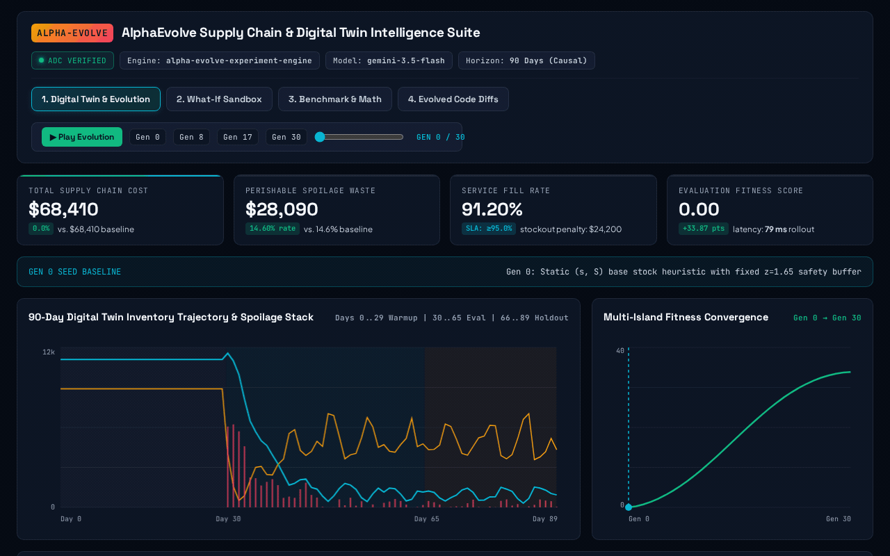

# AlphaEvolve Enterprise Use Cases

[](https://www.python.org/downloads/)
[](https://github.com/astral-sh/uv)
[](https://github.com/astral-sh/ruff)
[](https://github.com/astral-sh/ty)

A curated collection of production-grade, end-to-end **AlphaEvolve** code examples demonstrating how to architect and implement evolutionary coding agents with **Gemini Enterprise** to solve high-value enterprise optimization problems.

---

## What is AlphaEvolve?

AlphaEvolve is Google's agentic evolutionary coding capability powered by Gemini Enterprise. By combining the exploratory reasoning of Gemini models with automated closed-loop evaluation, AlphaEvolve autonomously explores, discovers, and optimizes complex algorithms, heuristics, and decision policies.

---

## Repository Structure

```
├── examples/                   # Standalone, end-to-end enterprise use cases
│   ├── inventory_replenishment/# Multi-Echelon & Perishable Inventory Digital Twin
│   └── fleet_routing/          # Dynamic Fleet Routing & Dispatch Digital Twin (VRPTW)
├── src/alpha_evolve/           # Shared, type-safe AlphaEvolve client & runtime
│   ├── client.py               # Discovery Engine V1alpha REST API client
│   ├── controller.py           # Evolutionary loop manager
│   ├── experiment.py           # High-level AlphaEvolveExperiment orchestrator
│   ├── evaluators/             # 3-tier BaseEvaluator & EvaluatorProtocol
│   ├── models.py               # Pydantic data schemas (ExperimentConfig, ProgramCandidate, Scores)
│   ├── utils.py                # EVOLVE-BLOCK extraction, candidate compilation & artifact export
│   ├── workers.py              # Isolated evaluation worker pool (process/subprocess/thread)
│   └── dashboard/              # Trajectory generators, SSE broker & Safe DOM compiler
├── dashboard/                  # Compiled static dashboard bundle (index.html, data.json)
├── records/                    # Precompiled 31-generation multi-domain trajectory datasets
├── server.py                   # Production HTTP server, /api/simulate & Gemini webhooks
├── docs/                       # Architectural specs, user guide, and session notes
├── pyproject.toml              # Modern uv project definition (ruff, ty, pytest)
└── Makefile                    # Standard developer workflow commands
```

---

## Quickstart

> [!TIP]
> For a detailed walkthrough of all execution modes, digital twin replay features, Cloud Run setup, and architecture maps, see the full [**Alpha Primer User Guide**](docs/USER_GUIDE.md).

### 1. Prerequisites

- Python `>=3.11`
- [`uv`](https://docs.astral.sh/uv/) package manager (`curl -LsSf https://astral.sh/uv/install.sh | sh`)
- Google Cloud SDK (`gcloud`) with access to Gemini Enterprise / Discovery Engine

### 2. Environment Setup

```bash
# Clone the repository
git clone <repo-url>
cd alpha-primer

# Install dependencies with uv
make dev
# or: uv sync --frozen --all-groups
```

### 3. Configure Google Cloud Access

Copy `.env.example` to `.env` and fill in your project credentials:

```bash
cp .env.example .env
```

To run offline in **Dry-Run Mode** without consuming Google Cloud quotas, set `MOCK_ALPHAEVOLVE=true` in `.env` or pass the `--dry-run` flag.

### 4. Running Your First Use Case

Navigate to any example directory or run directly from root:

```bash
# 1. Perishable Inventory Replenishment Digital Twin (offline dry-run or live API)
uv run --frozen python examples/inventory_replenishment/run_evolution.py --dry-run --max-programs 5
uv run --frozen python examples/inventory_replenishment/run_evolution.py --max-programs 20

# 2. Dynamic Fleet Routing & Dispatch Digital Twin (VRPTW) (offline dry-run or live API)
uv run --frozen python examples/fleet_routing/run_evolution.py --dry-run --max-programs 5
uv run --frozen python examples/fleet_routing/run_evolution.py --max-programs 20
```

#### What Happens When You Run This Command?
- **UI & Observability**: Execution runs directly in your terminal with live evaluation metrics streamed to the console (or pass `--stream-to-dashboard` to broadcast real-time Server-Sent Events to the web dashboard). You can optionally view the assistant and session history in the [Google Cloud Console](https://console.cloud.google.com/gen-app-builder/engines).
- **Cloud Resources Created**: Uses **serverless API resources** within your existing Discovery Engine. No VMs, GKE clusters, or persistent disks are created. Specifically, it dynamically provisions:
  1. An episodic **Session** under your engine.
  2. An **AlphaEvolve Experiment** entity defining the optimization goal and prompts.
  3. The **Seed Program** and evolutionary **Program Candidates**.
- **Execution Split**:
  - *LLM reasoning & code mutation* occurs serverlessly in Gemini Enterprise.
  - *Evaluation & digital twin simulation* runs **locally on your machine** inside an isolated worker pool—your proprietary evaluation data and simulation logic never leave your environment.
- **Output Artifacts**: When complete, the winning code and holdout benchmark results are saved locally to `artifacts/inventory_replenishment/` or `artifacts/fleet_routing/` (`best_evolved_program.py` and `best_evaluation_summary.json`).
See [docs/notes/cloud_resources_and_execution.md](docs/notes/cloud_resources_and_execution.md) for full architectural details.

### 5. Launching & Hosting the Interactive Executive Dashboard

**Local Execution:**
Launch the local web server to interact with the dashboard:

```bash
uv run --frozen python server.py
```

Open [http://127.0.0.1:8080](http://127.0.0.1:8080) in your browser. (Zero external server dependencies required; runs on standard library `http.server` with optional FastAPI/Uvicorn support).

**Google Cloud Run Deployment:**
To deploy the interactive UI as a serverless service on Google Cloud Run and register it with Gemini Enterprise:

```bash
PROJECT_ID="your-gcp-project-id" ./scripts/deploy_cloud_run.sh
```

See [docs/notes/google_cloud_run_hosting.md](docs/notes/google_cloud_run_hosting.md) for full Cloud Run architecture, IAM roles, and Gemini Enterprise external agent registration details.

---

## 🎬 Interactive Executive Walkthrough (`.gif`)



### Interactive Dashboard & Live API Capabilities

The repository includes a decoupled web dashboard (`dashboard/index.html` + `server.py`) for visually exploring multi-domain supply chain and logistics digital twins and verifying AlphaEvolve's optimization trajectories:

1. **Multi-Use-Case Domain Switcher & 31-Generation Evolution Scrubber**:
   - Seamlessly switch in the top header between **📦 Retail & Perishable Inventory** (50 SKUs, 90-day causal horizon) and **🚚 Dynamic Fleet Routing (VRPTW)** (50 customer stops across 4 urban quadrant clusters, 5 vehicles, 12-hour shift with dynamic order waves and rush-hour congestion).
   - **Inventory Replenishment Trajectory**: Scrub through Generations `0` to `30` from **Gen 0** Static $(s, S)$ baseline ($68.4k cost, 14.6% spoilage) &rarr; **Gen 8** Censored Demand Imputation &rarr; **Gen 17** Dynamic FIFO Spoilage Deduction &rarr; **Gen 30** Global Champion ($45.2k cost, **-33.9% reduction**, 93.49% fill rate, 8.45% spoilage).
   - **Fleet Routing 2D Route Topology Map & Shift Trajectory**: Toggle Canvas 1 between the **2D Route Topology Map** and the **90-Step Shift Trajectory**. The 2D Route Topology Map renders a dual-viewport Retina Canvas 2D comparing **Gen 0: Greedy Baseline** (crisscrossing tours, 19 intra-route crossings, 20 late stops) side-by-side against **Gen 7** (Slack Urgency Ranking), **Gen 16** (Traffic Congestion + 2-Opt Uncrossing), and **Gen 30: Regret-2 + 2-Opt Champion** ($2,931 validation cost, **-28.5% reduction**, 97.2% on-time SLA, 1,118.0 km distance, **0 intra-route crossings**), complete with a live center `DELTA HUD` (`Crossings`, `Late Stops`, `On-Time`, `Distance`, and `PEAK WAVE LOAD` vehicle bars), wave/vehicle filters (`All Waves`, `Wave 0 (Static)`, `Waves 1–4 (Dynamic)`, `SLA Breaches`, `V0`–`V4`), and customer stop hover tooltips.
2. **Interactive What-If Sandbox (`POST /api/simulate`)**:
   - Connected directly to the live backend simulation endpoint (`POST /api/simulate`) with debounced request race-condition guards and automatic `<2ms` in-browser fallback when offline.
   - Executes real `InventoryDigitalTwin` and `FleetRoutingDigitalTwin` rollouts comparing Baseline vs. Champion policies under supplier lead-time delays (`+0` to `+5 days`) or urban traffic congestion delays (`+0` to `+60 mins`), promotional demand / dynamic order surges (`+0%` to `+150%`), and spoilage/tardiness & stockout/unserved penalty multipliers (`0.5x` to `3.0x`) across domain archetypes.
3. **Multi-Domain Gemini Enterprise Grounding Webhook (`/api/agent/query`)**:
   - Exposes `GET/POST /api/agent/query` (plus backward-compatible `/api/agent/replenish-query`) for Gemini Enterprise StreamAssist agents (`inventory-replenishment-twin` and `fleet-routing-twin`).
   - Returns structured executive Markdown grounding cards, champion metrics, algorithmic innovations, and live `what_if_stress_test` digital twin simulations when disruption parameters are supplied.
4. **Domain Objective Mathematics & High-Visibility Evolved Code Diffs**:
   - Inspect domain-adaptive objective function equations, causal 3-phase operational horizons, 2D Pareto Frontier & 31-Generation Stacked Cost Waterfall charts, and zero-dependency AST/LCS **Split** and **Unified** Python code diffs across milestone generations.

---

## 🏛️ System Architecture & Reference Designs


For complete high-resolution architecture diagrams, PaperBanana statistical trajectory plots, and execution workflows, see [docs/architecture/README.md](docs/architecture/README.md):
- **Closed-Loop AlphaEvolve Evolutionary Process (`alphaevolve_process_paperbanana.png`)**: 3-zone methodology diagram covering Problem Specification & Seed (`# EVOLVE-BLOCK`), the Server-Side Cloud Evolutionary Engine (`Multi-Island Topology` + `MAP-Elites Grid`, weighted Gemini ensemble mutation), and the Client-Side Data-Private Evaluation Loop (`RLIMIT_AS` sandboxed worker pool + 3-tier causal evaluation cascade).
- **31-Generation Multi-Island Trajectory Plot (`alphaevolve_trajectory_plot_paperbanana.png`)**: Dual-benchmark Pareto cost and SLA convergence across Perishable Inventory Replenishment (`-33.9%` cost) and Dynamic Fleet Routing VRPTW (`-28.5%` cost).
- **Cloud Run & Gemini Assistant Grounding**: Production deployment topology and external agent webhook routing.

---

## Featured Use Cases

| Example | Vertical | Method | Evaluation Paradigm | Primary Metric |
| :--- | :--- | :--- | :--- | :--- |
| [Inventory Replenishment](examples/inventory_replenishment/README.md) | Grocery, Retail, Supply Chain | Dynamic $(s, S)$ FIFO Cohort Aging & Critical Fractile | **Simulation** (`InventoryDigitalTwin`) | Total Supply Chain Cost Reduction (`-33.9%`) & Spoilage Rate (`8.45%`) |
| [Dynamic Fleet Routing (VRPTW)](examples/fleet_routing/README.md) | Logistics, Last-Mile Delivery, Transportation | Regret-2 Insertion + Traffic-Aware 2-Opt / Or-Opt | **Simulation** (`FleetRoutingDigitalTwin`) | Total Fleet Shift Cost Reduction (`-28.5%`) & On-Time SLA (`97.2%`) |

---

## Development & Testing

We enforce strict quality and modern Python standards (see [CODE_STANDARDS.md](CODE_STANDARDS.md)):

```bash
make lint       # uv run --frozen ruff check .
make format     # uv run --frozen ruff format .
make typecheck  # uv run --frozen ty check src/
make test       # uv run --frozen pytest -v
make check      # runs all lint, format-check, typecheck, and test checks
```
