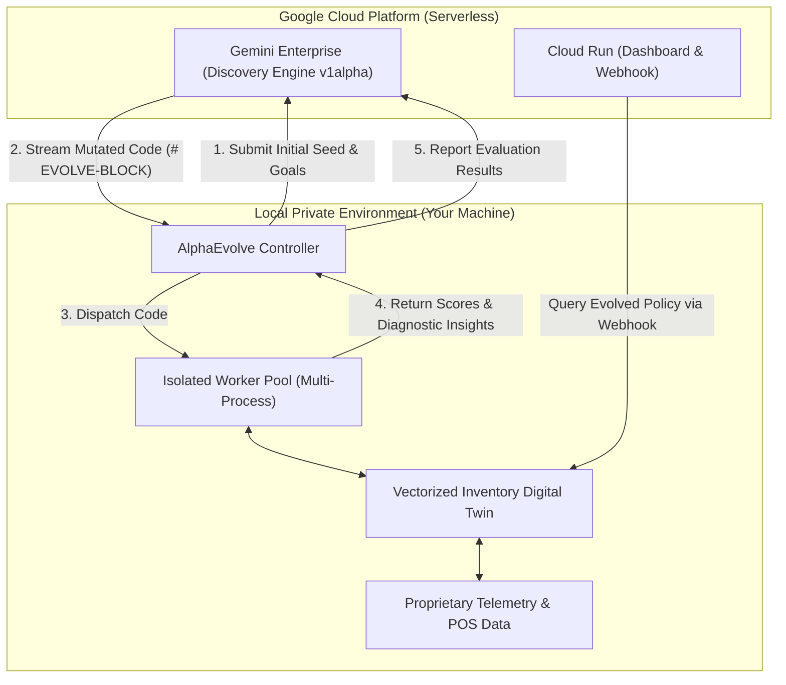

# Alpha Primer User Guide: End-to-End Operational Manual

This guide provides an end-to-end operational walkthrough of the `alpha-primer` repository, covering architecture concepts, prerequisites, execution modes, interactive visualizations, Cloud Run deployment, and developer workflows.

---

## 1. Overview & Core Concept

`alpha-primer` is a reference framework for **Google Cloud AlphaEvolve with Gemini Enterprise** (Discovery Engine v1alpha).

It solves complex enterprise optimization challenges by pairing LLM code-generation capabilities with closed-loop, data-isolated simulation engines.

### The Hybrid Execution Split

A foundational architectural principle of this repository is the strict separation between cloud-based LLM reasoning and private, local evaluation:



- **Cloud (Serverless)**: Gemini Enterprise manages the evolutionary session and generates code mutations based on structured evaluation feedback.
- **Local (Isolated Sandbox)**: Digital twin simulations run 100% locally. Proprietary business logic, cost formulas, and customer demand datasets never leave your private environment.

---

## 2. Prerequisites & Environment Setup

This project uses [`uv`](https://docs.astral.sh/uv/) for package and virtual environment management, [`ruff`](https://github.com/astral-sh/ruff) for linting and formatting, [`ty`](https://github.com/astral-sh/ty) for type checking, and [`pytest`](https://pytest.org/) for tests.

### Step 1: Install `uv`
```bash
curl -LsSf https://astral.sh/uv/install.sh | sh
```

### Step 2: Clone and Install Dependencies
```bash
git clone https://github.com/tottenjordan/alpha-primer.git
cd alpha-primer

# Synchronize all dependency groups using uv
uv sync --all-groups
```

### Step 3: Configure Environment
Copy the example configuration to `.env`:
```bash
cp .env.example .env
```

Key environment variables:
| Variable | Description | Default / Example |
| :--- | :--- | :--- |
| `PROJECT_ID` | Google Cloud Project ID | `hybrid-vertex` |
| `LOCATION` | Cloud Engine location | `global` |
| `COLLECTION_ID` | Discovery Engine collection | `default_collection` |
| `ENGINE_ID` | Discovery Engine app ID | `alpha-evolve-experiment-engine` |
| `MOCK_ALPHAEVOLVE` | Enable offline mock client | `false` (or set `true` for offline) |

### Step 4: Google Cloud Authentication (For Cloud Modes)
```bash
gcloud auth application-default login
gcloud config set project <YOUR_PROJECT_ID>
```

---

## 3. The 5 Execution Modes

### Mode A: Local Dry-Run (Offline Testing, Zero Cloud Quotas)
Run the full evolutionary loop locally without sending any API requests to Google Cloud. The system uses a deterministic mock client that generates synthetic candidate mutations to test your simulation engine and evaluator harness.

```bash
uv run python examples/inventory_replenishment/run_evolution.py --dry-run --max-programs 5
```

- **When to use**: Continuous Integration (CI), local code development, debugging evaluators, and rapid syntax verification.
- **Output**: Terminal logs displaying generation-by-generation scores and diagnostic insights.

---

### Mode B: Cloud Evolution with Gemini Enterprise
Execute live evolutionary search against Google Cloud Discovery Engine's AlphaEvolve v1alpha API:

```bash
uv run python examples/inventory_replenishment/run_evolution.py --max-programs 25 --workers 4
```

- **Execution Flow**:
  1. Initializes a serverless session under your Discovery Engine instance.
  2. Creates an `alphaEvolveExperiments` resource and registers the initial baseline seed from `examples/inventory_replenishment/src/program.py`.
  3. Gemini 3.5 Flash inspects past scores and diagnostic insights to propose targeted code mutations in `# EVOLVE-BLOCK`.
  4. Local workers run the 3-tier evaluator, calculating cost reductions, fill rates, and spoilage metrics.
  5. The cycle repeats until `--max-programs` is reached or convergence is achieved.
  6. Exports the global champion program to `artifacts/inventory_replenishment/best_evolved_program.py`.

---

### Mode C: Launch the Interactive Dashboard (Local Development)
Serve the interactive executive dashboard locally using the built-in web server:

```bash
uv run python server.py
```
Open **[http://127.0.0.1:8080](http://127.0.0.1:8080)** in your browser.

#### Dashboard Capabilities
1. **Digital Twin Replay (Tab 1)**:
   - Scrub through 31 generations of evolution across a 90-day simulation.
   - **Dual Canvas Visualization**:
     - *Mode A (Pareto Frontier)*: 2D plot of Customer Service Fill Rate vs. Cost Reduction with perishable spoilage bubble gradients and the non-dominated frontier envelope.
     - *Mode B (Cost Waterfall)*: Stacked 31-generation breakdown showing reductions across Spoilage (-$11.9k), Stockout Penalties (-$9.6k), and Holding Costs (-$1.2k).
   - **Interactive Milestone Ribbon**: Click to jump directly to key breakthrough generations (Gen 0 Baseline, Gen 8 Censored Imputation, Gen 17 FIFO Spoilage Deduction, Gen 30 Global Champion).
2. **What-If Sandbox (Tab 2)**:
   - Run dual-policy stress tests comparing the Baseline $(s, S)$ and the Champion heuristic side-by-side.
   - Adjust supplier lead-time delays (+1 to +5 days) and promotional demand shocks (+10% to +80%) in real time.
3. **Benchmark & Perishability Mathematics (Tab 3)**:
   - Inspect Wilcoxon signed-rank significance tests ($p < 0.001$), Monte Carlo seed distributions, and closed-form equations for FIFO cohort aging and critical fractiles.
4. **Evolved Code Diffs (Tab 4)**:
   - High-visibility AST code diff viewer powered by client-side LCS diffing and zero-dependency Python syntax highlighting.
   - Toggle between **Split** (side-by-side) and **Unified** diffs with line badges and foldable unchanged sections.
   - Use the **Milestone AST Stepper** to inspect exact code mutations between generations.

---

### Mode D: Serverless Cloud Run Deployment
Deploy the full web dashboard and Gemini agent webhook to Google Cloud Run:

```bash
./scripts/deploy_cloud_run.sh
```

#### What This Provisions
- Submits a multi-stage container build to **Google Cloud Build** (`gcr.io/<PROJECT_ID>/alpha-evolve-primer-ui:latest`).
- Deploys a managed **Cloud Run** service in `us-central1` with strict security headers (CSP, HSTS, frame-ancestors).
- Endpoints exposed:
  - `GET /` — Interactive executive dashboard.
  - `GET /health` — Service health and ADC credential status.
  - `GET /api/cloud-status` — Discovery Engine connection and experiment metadata.
  - `POST /api/agent/replenish-query` — Natural-language webhook for conversational agent grounding.

---

### Mode E: Developer Quality & Test Workflows
All contributions must adhere to the quality standards defined in `CODE_STANDARDS.md`:

```bash
# Run full test suite (29 tests)
uv run --frozen pytest -v

# Run ruff linter
uv run --frozen ruff check .

# Run ruff code formatter check
uv run --frozen ruff format --check .

# Run static type checking with ty
uv run --frozen ty check src/

# Run all checks at once
make check
```

---

## 4. Authoring Custom Evaluators (`BaseEvaluator`)

AlphaEvolve uses a **multi-tiered evaluation architecture** (`src/alpha_evolve/evaluators/`) to accelerate evolutionary loops by early-exiting broken candidates before running expensive simulations:

1. **Tier 1 (Smoke Sanity Check, <100ms)**: Fast input/output shape, type (`np.ndarray`), numerical validity (no NaN/Inf), and domain constraint checks.
2. **Tier 2 (Validation Rollout, 1s-30s)**: Full simulation computing primary fitness score and diagnostic feedback strings.
3. **Tier 3 (Holdout Generalization)**: Out-of-sample evaluation on unseen test datasets to detect overfitting.

### Creating a Domain Evaluator Subclass

To create a new evaluator for your domain:
1. Subclass `BaseEvaluator` from `alpha_evolve.evaluators`.
2. Define class attributes: `name`, `primary_metric`, `higher_is_better`, and `target_function_name`.
3. Implement `evaluate_smoke()` and `evaluate_validation()`.
4. (Optional) Implement `setup()` to cache datasets and `evaluate_holdout()` for out-of-sample testing.

```python
from typing import Any
from alpha_evolve.evaluators import BaseEvaluator, EvaluationTier, TierResult


class MyCustomEvaluator(BaseEvaluator):
    name = "my_custom_evaluator"
    primary_metric = "cost_reduction_pct"
    higher_is_better = True
    target_function_name = "solve"

    def evaluate_smoke(self, candidate_callable: Any) -> TierResult:
        try:
            out = candidate_callable(0)
            if out < 0:
                return TierResult.failure(EvaluationTier.SMOKE, "Output must be non-negative")
            return TierResult.success(EvaluationTier.SMOKE, {"smoke_passed": 1.0})
        except Exception as e:
            return TierResult.failure(EvaluationTier.SMOKE, f"Crashed: {e}")

    def evaluate_validation(self, candidate_callable: Any) -> TierResult:
        # Run simulation and score
        score = candidate_callable(10)
        return TierResult.success(
            EvaluationTier.VALIDATION,
            metrics={"cost_reduction_pct": float(score)},
            insights={"summary": f"Achieved score {score}"},
        )
```

Pass the evaluator instance directly to `AlphaEvolveExperiment` or `EvolutionController`:
```python
experiment = AlphaEvolveExperiment.from_files(
    experiment_name="My Optimization",
    instructions_path="instructions.md",
    seed_program_path="src/program.py",
    evaluator=MyCustomEvaluator(),
)
```

---

## 5. Key Repository Map

```
alpha-primer/
├── examples/inventory_replenishment/  # Flagship use case: Perishable inventory digital twin
│   ├── src/
│   │   ├── program.py                 # Candidate policy (# EVOLVE-BLOCK)
│   │   ├── simulator.py               # Vectorized FIFO inventory digital twin engine
│   │   ├── evaluate.py                # InventoryReplenishmentEvaluator (3-tier validation harness)
│   │   └── report.py                  # Post-evolution benchmark reporting
│   ├── tests/                         # Unit tests for simulator and evaluator
│   ├── DATASET.md                     # Complete dataset specification (50 SKUs, 90 days)
│   ├── README.md                      # Use case summary and problem formulation
│   └── run_evolution.py               # CLI entrypoint for local or cloud evolution
├── src/alpha_evolve/                  # Core client library & orchestration runtime
│   ├── client.py                      # Discovery Engine v1alpha REST client with ADC
│   ├── controller.py                  # Evolutionary search loop manager
│   ├── evaluators/                    # Abstract Evaluator Protocol & BaseEvaluator ABC
│   │   ├── __init__.py                # Exported protocol schemas and base classes
│   │   └── base.py                    # EvaluationTier, TierResult, EvaluatorProtocol, BaseEvaluator
│   ├── models.py                      # Type-safe Pydantic schemas (scores, insights, configs)
│   ├── workers.py                     # Signal-safe multi-process evaluation worker pool
│   └── dashboard/                     # Trajectory aggregation & dashboard compiler
├── dashboard/                         # Web dashboard assets
│   ├── index.html                     # Safe DOM, Retina Canvas 2D, LCS diff engine
│   └── data.json                      # Precompiled 31-generation trajectory records
├── server.py                          # Zero-dependency HTTP server & agent webhook
├── scripts/
│   └── deploy_cloud_run.sh            # Automated Cloud Build & Cloud Run deployment script
├── docs/
│   ├── USER_GUIDE.md                  # This document
│   ├── architecture/                  # High-resolution architectural diagrams
│   └── notes/                         # Technical session notes and wire specifications
├── CODE_STANDARDS.md                  # Development rules (uv, ruff, ty, pytest, git)
└── pyproject.toml                     # Modern PEP 621/735 project configuration
```

---

## 6. Further Reading & Documentation

- [**Abstract Evaluator Protocol**](notes/abstract_evaluator_protocol.md): Multi-tier evaluation design, short-circuiting architecture, lifecycle hooks, and authoring guide.
- [**Dataset Specification**](../examples/inventory_replenishment/DATASET.md): Full breakdown of SKU distributions, Poisson demand, promo lifts, and cost parameters.
- [**Architecture Diagrams**](architecture/README.md): Reference diagrams for the hybrid evolutionary architecture, Cloud Run integration, and digital twin loop.
- [**AlphaEvolve REST Wire Specification**](notes/alphaevolve_api_wire_spec.md): Complete HTTP wire schemas for Discovery Engine v1alpha.
- [**Cloud Run Hosting & Agent Grounding**](notes/google_cloud_run_hosting.md): Deployment architecture, IAM roles, and Gemini Enterprise agent webhook registration.
