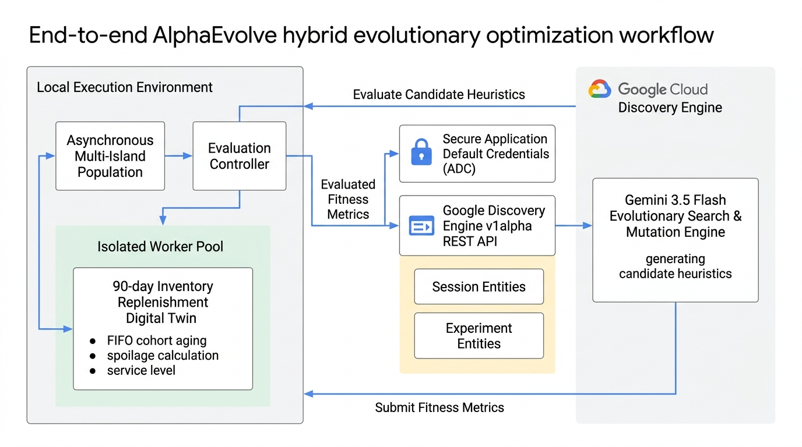
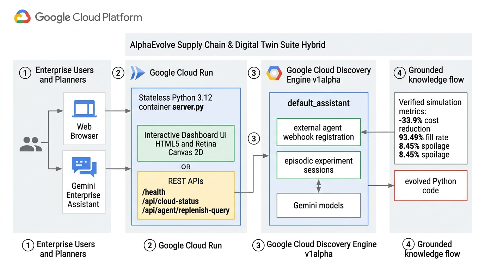
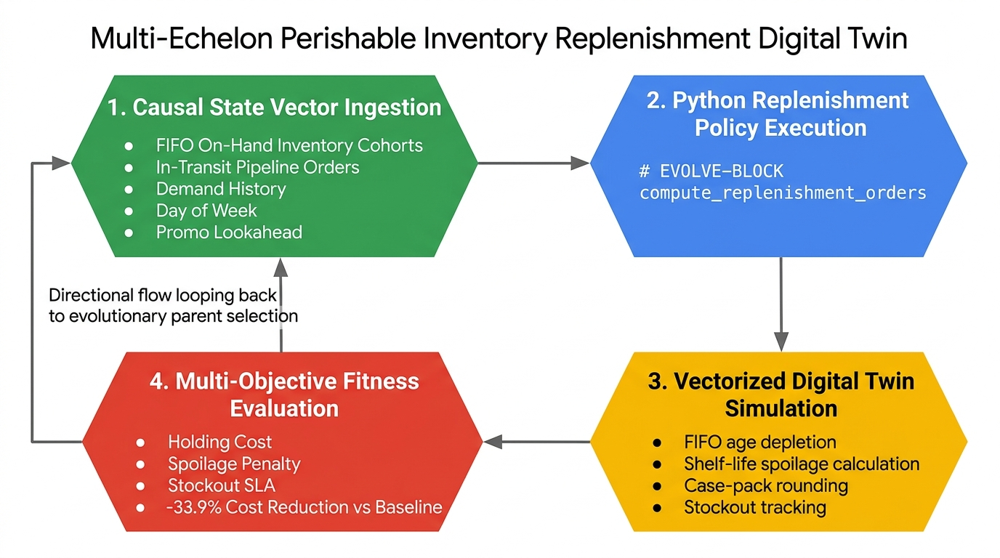

# System Architecture & Technical Workflows

This document details the architectural reference designs and workflows powering the **AlphaEvolve Enterprise Primer** suite, including cloud-to-edge execution, digital twin simulation loops, and Gemini Enterprise integration.

---

## 1. End-to-End AlphaEvolve Multi-Island Architecture

The AlphaEvolve platform follows a **hybrid, causally-isolated architecture** connecting Google Cloud's serverless Gemini Enterprise engine with a local, data-private evaluation runtime.

### Architecture Highlights:
- **Local Execution Environment (Data Private)**:
  - **Asynchronous Multi-Island Population**: Four asynchronous evolutionary sub-populations (Islands 0..3) exploring parallel heuristic trajectories with ring migration topologies.
  - **Evaluation Controller**: Coordinates mutation candidate polling, program extraction, and worker dispatching.
  - **Isolated Worker Pool**: Process-isolated sandbox executing candidate algorithms against 90-day causal inventory datasets. Proprietary customer demand data never leaves the local environment.
- **Google Cloud Discovery Engine v1alpha**:
  - **Session & Experiment Entities**: Dynamic, episodic metadata management tracking generation lineage and candidate programs.
  - **Gemini 3.5 Flash Search & Mutation Engine**: Discovers non-linear, multi-echelon replenishment policies via AST code mutations.

---

## 2. Google Cloud Run & Gemini Enterprise Integration Workflow

The production deployment provides a decoupled web dashboard and bidirectional agent grounding with Gemini Enterprise assistants.

### Workflow Steps:
1. **Multi-Channel User Engagement**:
   - Supply chain planners explore interactive 90-day trajectories and what-if stress tests via the Web Browser.
   - Enterprise knowledge workers query the Gemini Enterprise Conversational Assistant.
2. **Google Cloud Run (`alpha-evolve-primer-ui`)**:
   - Stateless Python 3.12 container running non-root on port 8080 with automated scale-to-zero.
   - Serves the HTML5 / Retina Canvas 2D executive dashboard alongside hardened REST endpoints (`/health`, `/api/cloud-status`, `/api/agent/replenish-query`).
3. **Google Cloud Discovery Engine Registration**:
   - The Cloud Run service is registered as an **External Assistant Agent** (`default_assistant/agents/inventory-replenishment-twin`).
   - Query dispatches are routed to `/api/agent/replenish-query` for sub-second grounding.
4. **Grounded Knowledge Delivery**:
   - Returns verified simulation metrics (**-33.9% cost reduction**, **93.49% fill rate**, **8.45% spoilage**) and 1-click clipboard export of winning Python `# EVOLVE-BLOCK` code.

---

## 3. Multi-Echelon Perishable Inventory Evaluation Loop

The evaluation harness implements a rigorous 4-phase closed-loop cycle executing within process-isolated worker sandboxes.

### Evaluation Lifecycle:
1. **Phase 1: Causal State Vector Ingestion**:
   - Ingests FIFO on-hand inventory cohorts, pipeline in-transit orders, censored sales history, day-of-week indices, and 7-day promotional discount schedules. No future information is exposed.
2. **Phase 2: Python Policy Execution**:
   - Executes candidate `# EVOLVE-BLOCK` heuristic (`compute_replenishment_orders`) with strict 10-second CPU time limits and memory caps.
3. **Phase 3: Vectorized Digital Twin Simulation**:
   - Simulates daily customer demand realization, FIFO age depletion, shelf-life expiration spoilage, and supplier MOQ/case-pack rounding over 90 days (Warmup: days 0..29, Validation: days 30..65, Holdout: days 66..89).
4. **Phase 4: Multi-Objective Fitness Evaluation**:
   - Computes composite fitness penalizing holding costs ($0.10–$0.40/unit), perishable spoilage ($2.50–$5.50/unit), and stockout penalties ($5.00–$9.00/unit), requiring $\ge 95\%$ service SLA compliance before selecting elite parents for the next generation.
