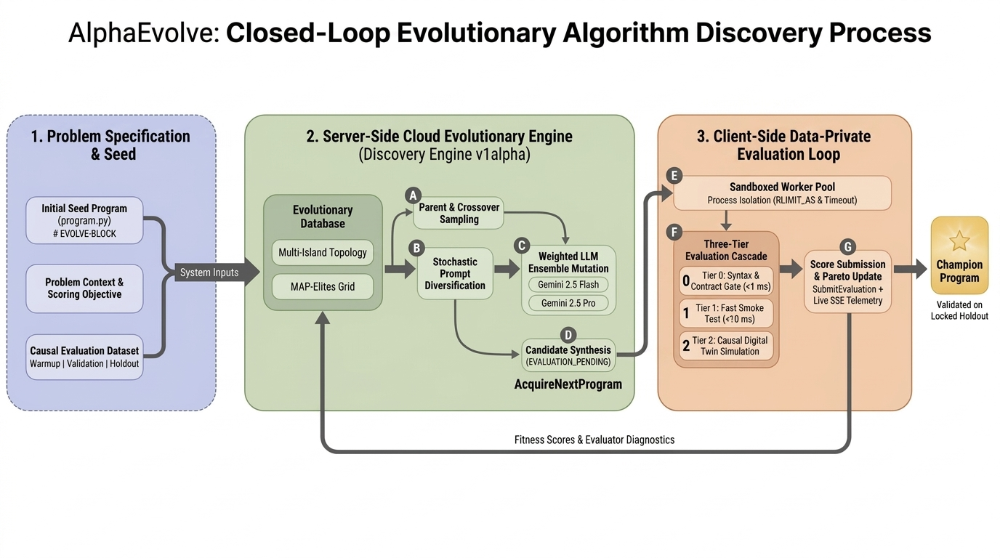
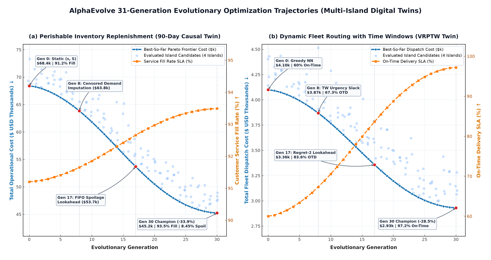
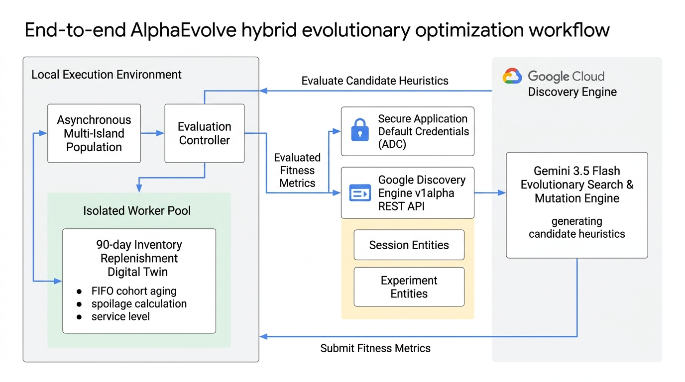
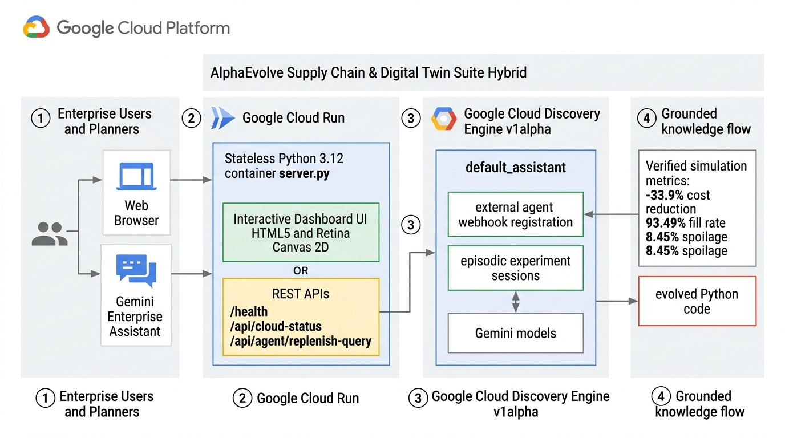
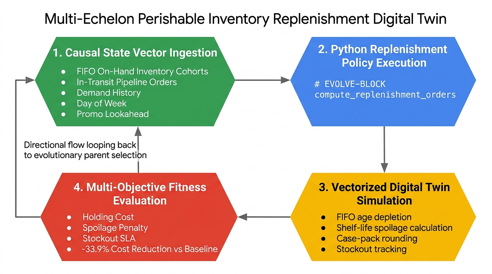

# System Architecture & Technical Workflows

This document details the architectural reference designs and workflows powering the **AlphaEvolve Enterprise Primer** suite, including cloud-to-edge execution, digital twin simulation loops, and Gemini Enterprise integration.

---

## 1. End-to-End AlphaEvolve Closed-Loop Process (PaperBanana NeurIPS Visualization)

The AlphaEvolve platform operates as a **three-zone closed-loop evolutionary algorithm discovery pipeline**, coupling problem specification & seed initialization with Google Cloud's serverless Discovery Engine (`v1alpha`) and a client-side, data-private evaluation harness.

### Three-Zone Process Breakdown:
1. **Zone 1 — Problem Specification & Seed (`program.py`)**:
   - **Initial Seed Program (`program.py`)**: Isolates mutable heuristic logic inside `# EVOLVE-BLOCK` markers while locking surrounding simulation contracts.
   - **Problem Context & Scoring Objective**: Defines operational constraints and the monotonic multi-objective fitness function.
   - **Causal Evaluation Dataset**: Partitioned into **Warmup**, **Validation**, and locked **Holdout** windows.
2. **Zone 2 — Server-Side Cloud Evolutionary Engine (`Discovery Engine v1alpha`)**:
   - **Evolutionary Database**: Combines **Multi-Island Topology** (parallel sub-populations with periodic ring migration) and a **MAP-Elites Grid** (retaining elite performers across orthogonal metric dimensions).
   - **(A) Parent & Crossover Sampling** → **(B) Stochastic Prompt Diversification** → **(C) Weighted LLM Ensemble Mutation (`Gemini 2.5 Flash` | `Gemini 2.5 Pro`)** → **(D) Candidate Synthesis (`EVALUATION_PENDING`)**.
3. **Zone 3 — Client-Side Data-Private Evaluation Loop**:
   - **(E) Sandboxed Worker Pool**: Acquires pending candidates via `AcquireNextProgram` and executes them in process-isolated workers enforced by `RLIMIT_AS` memory limits and hard `SIGKILL` timeouts.
   - **(F) Three-Tier Evaluation Cascade (`BaseEvaluator`)**:
     - **Tier 0**: Syntax & Contract Gate (`<1 ms`)
     - **Tier 1**: Fast Smoke Test (`<10 ms`)
     - **Tier 2**: Causal Digital Twin Simulation
   - **(G) Score Submission & Pareto Update**: Streams live SSE telemetry, submits **Fitness Scores & Evaluator Diagnostics** via `SubmitEvaluation` back to the Evolutionary Database, and promotes the **Champion Program** (validated on the locked holdout split).

---

## 2. 31-Generation Multi-Island Optimization Trajectories

- **Panel (a) — Perishable Inventory Replenishment (90-Day Causal Twin)**: Best-so-far operational cost drops from **$68.4k** (`Gen 0: Static (s, S)`) to **$45.2k** (`Gen 30 Champion`, **-33.9% cost reduction**) while Customer Service Fill Rate rises from **91.2%** to **93.5%** and perishable spoilage drops to **8.45%**.
- **Panel (b) — Dynamic Fleet Routing with Time Windows (VRPTW Twin)**: Best-so-far fleet dispatch cost drops from **$4.10k** (`Gen 0: Greedy NN`) to **$2.93k** (`Gen 30 Champion`, **-28.5% cost reduction**) while On-Time Delivery SLA improves from **60.0%** to **97.2%**.

---

## 3. Hybrid Cloud-to-Edge Deployment Topology

---

## 4. Google Cloud Run & Gemini Enterprise Integration Workflow

The production deployment provides a decoupled web dashboard and bidirectional agent grounding with Gemini Enterprise assistants.

### Workflow Steps:
1. **Multi-Channel User Engagement**:
   - Supply chain planners explore interactive 90-day trajectories and what-if stress tests via the Web Browser.
   - Enterprise knowledge workers query the Gemini Enterprise Conversational Assistant.
2. **Google Cloud Run (`alpha-evolve-primer-ui`)**:
   - Stateless Python 3.12 container running non-root on port 8080 with automated scale-to-zero.
   - Serves the HTML5 / Retina Canvas 2D executive dashboard alongside hardened REST endpoints (`/health`, `/api/cloud-status`, `/api/agent/replenish-query`).
3. **Google Cloud Discovery Engine Registration**:
   - The Cloud Run service is registered as an **External Assistant Agent** (`default_assistant/agents/inventory-replenishment-twin`).
   - Query dispatches are routed to `/api/agent/replenish-query` for sub-second grounding.
4. **Grounded Knowledge Delivery**:
   - Returns verified simulation metrics (**-33.9% cost reduction**, **93.49% fill rate**, **8.45% spoilage**) and 1-click clipboard export of winning Python `# EVOLVE-BLOCK` code.

---

## 5. Multi-Echelon Perishable Inventory Evaluation Loop

The evaluation harness implements a rigorous 4-phase closed-loop cycle executing within process-isolated worker sandboxes.

### Evaluation Lifecycle:
1. **Phase 1: Causal State Vector Ingestion**:
   - Ingests FIFO on-hand inventory cohorts, pipeline in-transit orders, censored sales history, day-of-week indices, and 7-day promotional discount schedules. No future information is exposed.
2. **Phase 2: Python Policy Execution**:
   - Executes candidate `# EVOLVE-BLOCK` heuristic (`compute_replenishment_orders`) with strict 10-second CPU time limits and memory caps.
3. **Phase 3: Vectorized Digital Twin Simulation**:
   - Simulates daily customer demand realization, FIFO age depletion, shelf-life expiration spoilage, and supplier MOQ/case-pack rounding over 90 days (Warmup: days 0..29, Validation: days 30..65, Holdout: days 66..89).
4. **Phase 4: Multi-Objective Fitness Evaluation**:
   - Computes composite fitness penalizing holding costs ($0.10–$0.40/unit), perishable spoilage ($2.50–$5.50/unit), and stockout penalties ($5.00–$9.00/unit), requiring $\ge 95\%$ service SLA compliance before selecting elite parents for the next generation.
