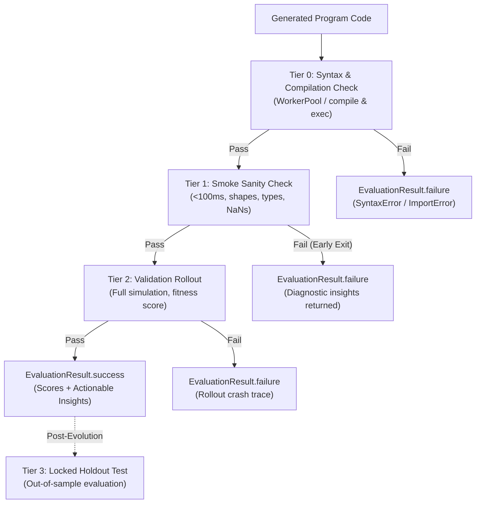

# Abstract Evaluator Protocol & Reference Architecture

## Overview & Motivation

In AlphaEvolve evolutionary optimization workflows, candidate code programs are generated iteratively by large language models. The evaluation harness must:
1. **Prevent wasted computation**: Candidates with syntax errors, runtime crashes, type errors, or constraint violations must be rejected immediately without running expensive multi-step simulations.
2. **Provide structured diagnostic feedback**: Returning actionable error messages and directional insights enables the LLM mutation prompt to correct mistakes on subsequent iterations.
3. **Guard against out-of-sample overfitting**: Providing clean separation between validation fitness scoring (guiding evolution) and locked holdout evaluation (verifying generalization).
4. **Decouple domain logic from controller orchestration**: Domain simulations should follow a standardized protocol so that new optimization problems can be plugged in without modifying the core evolutionary controller or worker pool.

The **Abstract Evaluator Protocol** (`src/alpha_evolve/evaluators/`) formalizes these requirements through a 4-tier lifecycle architecture.

---

## Architecture: The 4-Tier Evaluation Pipeline



### Tier Definitions

| Tier | Name | Target Runtime | Purpose & Checks |
| :--- | :--- | :--- | :--- |
| **Tier 0** | `SYNTAX` | `< 10ms` | Executed by `WorkerPool`: Python AST compilation, module scope execution, and required entrypoint function validation. |
| **Tier 1** | `SMOKE` | `< 100ms` | Fast unit sanity test on small synthetic batches: verifies return types (e.g. `np.ndarray`), output dimensions, numerical validity (no NaN/Inf), and basic boundary constraints (non-negativity). |
| **Tier 2** | `VALIDATION` | `1s – 30s` | Full domain simulation or benchmark rollout. Computes primary optimization metric (e.g., `cost_reduction_pct`), secondary KPIs, and diagnostic feedback strings. |
| **Tier 3** | `HOLDOUT` | Post-run | Locked out-of-sample test across unseen test periods/scenarios to ensure the evolved policy generalizes without reward hacking. |

---

## Core Classes & Protocol

### 1. `EvaluatorProtocol`
Defined in `src/alpha_evolve/evaluators/base.py` as a `@runtime_checkable` `typing.Protocol`:

```python
@runtime_checkable
class EvaluatorProtocol(Protocol):
    name: str
    primary_metric: str
    higher_is_better: bool
    target_function_name: str

    def setup(self) -> None: ...
    def teardown(self) -> None: ...
    def evaluate(self, candidate_callable: Any) -> EvaluationResult: ...
    def evaluate_holdout(self, candidate_callable: Any) -> EvaluationResult: ...
```

### 2. `TierResult`
Structured schema returned by individual tier methods:
- `tier: EvaluationTier`
- `passed: bool`
- `metrics: dict[str, float]`
- `insights: dict[str, str]` (automatically coerces values to strings)
- `error_message: str | None`
- `execution_time_s: float`

Constructed with `TierResult.success(...)` or `TierResult.failure(...)`.

### 3. `BaseEvaluator`
Abstract base class implementing `EvaluatorProtocol`:
- Defines configuration attributes: `name`, `primary_metric`, `higher_is_better`, `target_function_name`.
- Lifecycle hooks: `setup()` (called before evolution starts to pre-generate benchmark datasets) and `teardown()` (called in `finally:` to release resources).
- Abstract methods: `evaluate_smoke()` and `evaluate_validation()`.
- Default holdout method: `evaluate_holdout()`.
- Template method: `evaluate()` runs Tier 1, early-exits on failure, and executes Tier 2 on pass.
- Callable dunder: `__call__()` routes directly to `evaluate()`.

---

## Polymorphic Controller Integration

`EvolutionController` and `AlphaEvolveExperiment` support both `BaseEvaluator` instances and legacy callables (`evaluator_fn`):

```python
# Modern usage with BaseEvaluator subclass
evaluator = InventoryReplenishmentEvaluator()
experiment = AlphaEvolveExperiment.from_files(
    experiment_name="Inventory Optimization",
    instructions_path="instructions.md",
    seed_program_path="src/program.py",
    evaluator=evaluator,
)
best = experiment.run()

# Legacy usage with raw callable
experiment = AlphaEvolveExperiment.from_files(
    ...,
    evaluator_fn=legacy_evaluate_fn,
    target_function_name="compute_replenishment_orders",
    primary_metric="cost_reduction_pct",
)
```

When a `BaseEvaluator` instance is passed:
1. `target_function_name` and `primary_metric` are auto-extracted from evaluator metadata.
2. `evaluator.setup()` is invoked before evaluating candidates.
3. `evaluator.teardown()` is guaranteed to execute in `finally:`.

---

## Authoring Guide: Implementing a Custom Domain Evaluator

To build an evaluator for a new optimization domain:

```python
from typing import Any
import numpy as np
from alpha_evolve.evaluators import BaseEvaluator, EvaluationTier, TierResult


class PortfolioOptimizationEvaluator(BaseEvaluator):
    name: str = "portfolio_optimization_evaluator"
    primary_metric: str = "sharpe_ratio"
    higher_is_better: bool = True
    target_function_name: str = "allocate_weights"

    def setup(self) -> None:
        # Load historical return matrices once
        self.val_returns = np.load("data/returns_val.npy")
        self.holdout_returns = np.load("data/returns_holdout.npy")

    def evaluate_smoke(self, candidate_callable: Any) -> TierResult:
        dummy_state = np.ones((5, 10))
        try:
            weights = candidate_callable(dummy_state)
        except Exception as e:
            return TierResult.failure(EvaluationTier.SMOKE, f"Crashed on dummy state: {e}")

        if not isinstance(weights, np.ndarray) or weights.shape != (10,):
            return TierResult.failure(EvaluationTier.SMOKE, "Output shape must be (10,)")
        if not np.isclose(np.sum(weights), 1.0):
            return TierResult.failure(EvaluationTier.SMOKE, "Weights must sum to 1.0")

        return TierResult.success(EvaluationTier.SMOKE, {"smoke_ok": 1.0})

    def evaluate_validation(self, candidate_callable: Any) -> TierResult:
        # Simulate portfolio across validation dataset
        portfolio_returns = self.val_returns @ candidate_callable(self.val_returns)
        sharpe = float(np.mean(portfolio_returns) / (np.std(portfolio_returns) + 1e-8))

        return TierResult.success(
            EvaluationTier.VALIDATION,
            metrics={"sharpe_ratio": round(sharpe, 3)},
            insights={"risk_assessment": "Acceptable variance across validation period."},
        )
```
