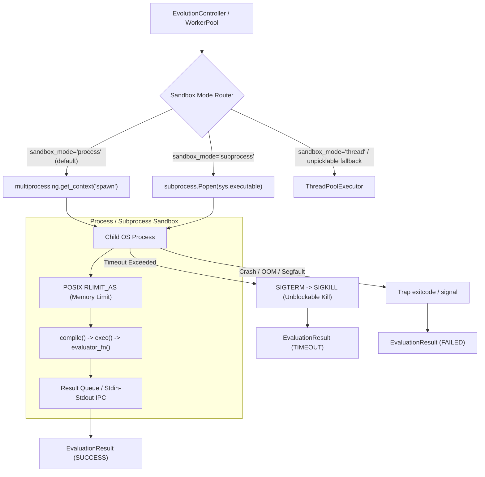

# Candidate Execution Sandboxing & Resource Isolation

## Overview & Motivation

In AlphaEvolve evolutionary optimization loops, candidate code programs are generated iteratively by Large Language Models. Running untrusted or synthetically generated Python code directly inside the controller or orchestrator process presents severe operational risks:

1. **CPU Starvation & Infinite Loops**: A candidate policy containing `while True: pass` or non-terminating recursion will block standard threads indefinitely because Python threads share the Global Interpreter Lock (GIL) and cannot be preempted or killed from the outside.
2. **Hard Process Termination**: If candidate code calls `os._exit()`, `sys.exit()`, or triggers a C-level memory corruption or segmentation fault (SIGSEGV) in native extensions (like NumPy or SciPy), the entire parent Python process is abruptly terminated, destroying the evolutionary search session.
3. **Memory Exhaustion (OOM)**: A candidate generating massive array allocations (e.g., `bytearray(50 * 1024**3)`) will trigger the Linux Out-Of-Memory (OOM) killer, which often kills the parent controller process.
4. **Environment & Global State Mutation**: Untrusted code executing in the same process can mutate `sys.modules`, `os.environ`, or global class singletons, corrupting subsequent evaluations.

To eliminate these vulnerabilities, `alpha-primer` implements a **multi-mode sandboxing architecture** (`src/alpha_evolve/workers.py`).

---

## Sandboxing Architecture



---

## Isolation Mechanisms

### 1. Dedicated Address Space (`spawn` context)
By default, the `ProcessSandbox` launches child processes using `multiprocessing.get_context("spawn")`. Unlike `fork` (which duplicates parent threads and memory structures, risking deadlocks), `spawn` starts a fresh Python interpreter process with an empty address space and clean GIL state.

### 2. POSIX Virtual Memory Capping (`RLIMIT_AS`)
Before executing any candidate code, the child process queries `max_memory_mb` from `SandboxConfig` and sets an operating-system level address space limit:
```python
import resource

bytes_limit = max_memory_mb * 1024 * 1024
resource.setrlimit(resource.RLIMIT_AS, (bytes_limit, bytes_limit))
```
If candidate code attempts to allocate memory beyond this threshold:
- Python immediately raises a catchable `MemoryError` inside the child process.
- The child catches the error and returns `EvaluationResult.failure(...)` with diagnostic label `sandbox_memory`.
- If memory is allocated outside Python's allocator (e.g. C extension), Linux sends `SIGKILL` (-9), which the parent supervisor traps without crashing.

### 3. Escalating Unblockable Termination (`SIGTERM` -> `SIGKILL`)
The parent worker supervisor waits on the child process for `timeout_s`:
```python
proc.join(timeout=config.timeout_s)
if proc.is_alive():
    proc.terminate()  # Send SIGTERM
    proc.join(timeout=0.3)
    if proc.is_alive():
        proc.kill()  # Send SIGKILL (unblockable)
        proc.join(timeout=0.3)
```
Even if a candidate executes an infinite CPU loop that never releases the GIL, `proc.kill()` (POSIX signal 9) cannot be caught or ignored, guaranteeing zero leaked CPU loops.

### 4. Crash and Signal Trapping
When a candidate calls `os._exit()`, crashes with an uncaught C exception, or is killed by a signal, the supervisor inspects `proc.exitcode`:
- `exitcode < 0`: Killed by signal (e.g., `-9` for SIGKILL/OOM, `-11` for SIGSEGV).
- `exitcode > 0`: Abnormal termination or explicit non-zero exit code.
In all cases, the supervisor safely catches the abnormal exit and returns a structured failure without terminating the main evolutionary loop:
```python
EvaluationResult.failure(
    f"Candidate process terminated abnormally (exitcode {proc.exitcode}).",
    insights={"tier": "sandbox_crash", "exitcode": str(proc.exitcode)},
)
```

### 5. Seamless Fallback for Unpicklable Closures
When unit tests or custom experiments use ad-hoc local closures or lambdas (which standard `pickle` cannot transfer across processes), the system logs a diagnostic message and falls back to `_execute_in_thread()`, ensuring 100% test compatibility while providing full process isolation for all standard module-level evaluators.

---

## Configuration via `RunSettings`

Sandboxing parameters are configured via `RunSettings` in `pyproject.toml` or code:

```python
from alpha_evolve.models import ExperimentConfig, RunSettings

config = ExperimentConfig(
    ...,
    run_settings=RunSettings(
        max_programs=50,
        parallel_workers=4,
        max_evaluation_time_s=15.0,  # Hard timeout per candidate
        max_memory_mb=2048,  # 2GB virtual memory cap per candidate
        sandbox_mode="process",  # "process", "subprocess", or "thread"
    ),
)
```
