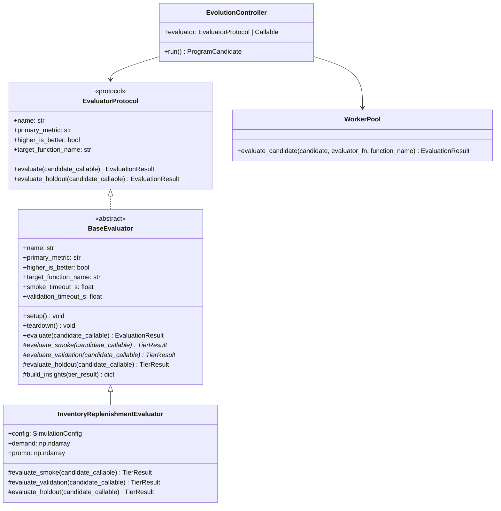
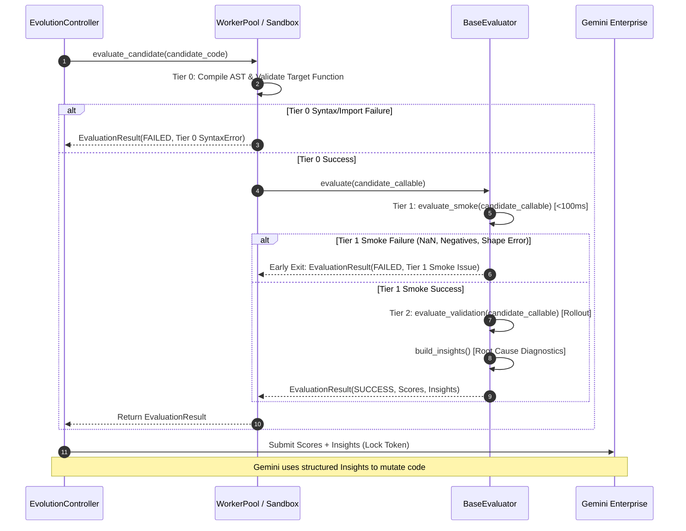

# Abstract Evaluator Protocol Implementation Plan

> **For Claude:** REQUIRED SUB-SKILL: Use superpowers:executing-plans to implement this plan task-by-task.

**Goal:** Build a standardized, type-safe, multi-tiered `BaseEvaluator` protocol and framework in `src/alpha_evolve/evaluators/` to enable seamless scaling across enterprise domains (supply chain, dynamic pricing, logistics routing, ad bidding) while maintaining backward compatibility with existing standalone evaluation functions.

**Architecture:** A `typing.Protocol` and abstract base class hierarchy (`EvaluatorProtocol`, `BaseEvaluator`) enforcing the 3-tier AlphaEvolve evaluation pattern (Tier 1 fast smoke test, Tier 2 validation rollout with diagnostic insight generation, Tier 3 locked holdout verification) with automatic execution timing, early exit on smoke failure, structured metrics schemas, and polymorphic controller integration.

**Tech Stack:** Python 3.11+, Pydantic v2, `typing.Protocol`, `abc.ABC`, `pytest`, `uv`, `ruff`, `ty`.

---

## Reference Architecture



### 3-Tier Evaluation Sequence Flow



---

## Bite-Sized Implementation Tasks

### Task 1: Evaluator Protocol & Tier Result Models

**Files:**
- Create: `src/alpha_evolve/evaluators/__init__.py`
- Create: `src/alpha_evolve/evaluators/base.py`
- Test: `tests/test_evaluator_protocol.py`

**Step 1: Write the failing test**

```python
# tests/test_evaluator_protocol.py
from __future__ import annotations

from typing import Any
import pytest
from alpha_evolve.evaluators.base import (
    EvaluationTier,
    EvaluatorProtocol,
    TierResult,
)


def test_tier_result_success_and_failure():
    succ = TierResult.success(
        tier=EvaluationTier.SMOKE,
        metrics={"latency_ms": 12.5},
        insights={"health": "passed"},
    )
    assert succ.passed is True
    assert succ.tier == EvaluationTier.SMOKE
    assert succ.metrics["latency_ms"] == 12.5
    assert succ.error_message is None

    fail = TierResult.failure(
        tier=EvaluationTier.SMOKE,
        error_message="Output contains NaNs",
        issue="nan_values",
    )
    assert fail.passed is False
    assert "NaNs" in fail.error_message
    assert fail.insights.get("issue") == "nan_values"


def test_evaluator_protocol_type_check():
    class DummyEvaluator:
        name = "dummy"
        primary_metric = "accuracy"
        higher_is_better = True
        target_function_name = "predict"

        def evaluate(self, candidate_callable: Any):
            from alpha_evolve.models import EvaluationResult

            return EvaluationResult()

        def evaluate_holdout(self, candidate_callable: Any):
            from alpha_evolve.models import EvaluationResult

            return EvaluationResult()

    dummy = DummyEvaluator()
    assert isinstance(dummy, EvaluatorProtocol)
```

**Step 2: Run test to verify it fails**
Run: `uv run --frozen pytest tests/test_evaluator_protocol.py -v`
Expected: FAIL with `ModuleNotFoundError: No module named 'alpha_evolve.evaluators'`

**Step 3: Write minimal implementation**

```python
# src/alpha_evolve/evaluators/base.py
from __future__ import annotations

from enum import Enum
from typing import Any, Protocol, runtime_checkable
from pydantic import BaseModel, Field

from alpha_evolve.models import EvaluationResult


class EvaluationTier(str, Enum):
    """Execution tiers for AlphaEvolve evaluation."""

    SYNTAX = "tier_0_syntax"
    SMOKE = "tier_1_smoke"
    VALIDATION = "tier_2_validation"
    HOLDOUT = "tier_3_holdout"


class TierResult(BaseModel):
    """Result of an individual evaluation tier."""

    tier: EvaluationTier
    passed: bool
    metrics: dict[str, float] = Field(default_factory=dict)
    insights: dict[str, str] = Field(default_factory=dict)
    error_message: str | None = None
    execution_time_s: float = 0.0

    @classmethod
    def success(
        cls,
        tier: EvaluationTier,
        metrics: dict[str, float] | None = None,
        insights: dict[str, str] | None = None,
        execution_time_s: float = 0.0,
    ) -> TierResult:
        return cls(
            tier=tier,
            passed=True,
            metrics=metrics or {},
            insights=insights or {},
            execution_time_s=execution_time_s,
        )

    @classmethod
    def failure(
        cls,
        tier: EvaluationTier,
        error_message: str,
        issue: str | None = None,
        insights: dict[str, str] | None = None,
    ) -> TierResult:
        diag = insights or {}
        if issue:
            diag["issue"] = issue
        return cls(
            tier=tier,
            passed=False,
            error_message=error_message,
            insights=diag,
        )


@runtime_checkable
class EvaluatorProtocol(Protocol):
    """Protocol defining the interface for domain evaluators."""

    name: str
    primary_metric: str
    higher_is_better: bool
    target_function_name: str

    def evaluate(self, candidate_callable: Any) -> EvaluationResult: ...
    def evaluate_holdout(self, candidate_callable: Any) -> EvaluationResult: ...
```

Export in `src/alpha_evolve/evaluators/__init__.py`:
```python
from .base import EvaluationTier, EvaluatorProtocol, TierResult

__all__ = ["EvaluationTier", "EvaluatorProtocol", "TierResult"]
```

**Step 4: Run test to verify it passes**
Run: `uv run --frozen pytest tests/test_evaluator_protocol.py -v`
Expected: PASS

**Step 5: Commit**
```bash
git add src/alpha_evolve/evaluators/ tests/test_evaluator_protocol.py
git commit -m "feat(evaluators): add EvaluatorProtocol and TierResult definitions"
```

---

### Task 2: BaseEvaluator Abstract Base Class with Tiered Execution & Diagnostics

**Files:**
- Modify: `src/alpha_evolve/evaluators/base.py`
- Modify: `src/alpha_evolve/evaluators/__init__.py`
- Test: `tests/test_evaluator_protocol.py`

**Step 1: Write the failing test**

```python
# Append to tests/test_evaluator_protocol.py
from alpha_evolve.evaluators.base import BaseEvaluator


class MockLinearEvaluator(BaseEvaluator):
    name = "mock_linear"
    primary_metric = "score"
    higher_is_better = True
    target_function_name = "compute"

    def evaluate_smoke(self, candidate_callable: Any) -> TierResult:
        res = candidate_callable(0)
        if res < 0:
            return TierResult.failure(
                EvaluationTier.SMOKE, "Negative output on zero", issue="neg_val"
            )
        return TierResult.success(EvaluationTier.SMOKE, {"smoke_ok": 1.0})

    def evaluate_validation(self, candidate_callable: Any) -> TierResult:
        score = float(candidate_callable(10))
        return TierResult.success(
            EvaluationTier.VALIDATION,
            metrics={"score": score},
            insights={"perf": f"Generated score {score}"},
        )


def test_base_evaluator_tiered_execution_success():
    evaluator = MockLinearEvaluator()
    result = evaluator.evaluate(lambda x: x * 2)
    assert result.status == "SUCCESS"
    assert result.scores.to_dict()["score"] == 20.0
    assert "perf" in result.insights.to_dict()
    assert result.execution_time_s >= 0.0


def test_base_evaluator_early_exit_on_smoke_failure():
    evaluator = MockLinearEvaluator()
    # Fails smoke test
    result = evaluator.evaluate(lambda x: -5)
    assert result.status == "FAILED"
    assert "Negative output" in result.error_message
    assert result.insights.to_dict()["issue"] == "neg_val"
    assert result.insights.to_dict()["tier"] == EvaluationTier.SMOKE.value
```

**Step 2: Run test to verify it fails**
Run: `uv run --frozen pytest tests/test_evaluator_protocol.py -v`
Expected: FAIL with `ImportError: cannot import name 'BaseEvaluator'`

**Step 3: Implement `BaseEvaluator` in `src/alpha_evolve/evaluators/base.py`**

```python
import abc
import time
from alpha_evolve.models import (
    AlphaEvolveEvaluationInsights,
    AlphaEvolveEvaluationScores,
    EvaluationResult,
)


class BaseEvaluator(abc.ABC):
    """Abstract base class orchestrating tiered candidate evaluation."""

    name: str = "base_evaluator"
    primary_metric: str = "score"
    higher_is_better: bool = True
    target_function_name: str = "compute"
    smoke_timeout_s: float = 2.0
    validation_timeout_s: float = 30.0

    def setup(self) -> None:
        """Hook called before evaluation runs to precompute constants or cache datasets."""
        pass

    def teardown(self) -> None:
        """Hook called to release resources after evolution completes."""
        pass

    @abc.abstractmethod
    def evaluate_smoke(self, candidate_callable: Any) -> TierResult:
        """Tier 1: Fast sanity check (<100ms) verifying types, shapes, and constraints."""
        raise NotImplementedError

    @abc.abstractmethod
    def evaluate_validation(self, candidate_callable: Any) -> TierResult:
        """Tier 2: Full validation rollout computing primary fitness and diagnostic insights."""
        raise NotImplementedError

    def evaluate_holdout(self, candidate_callable: Any) -> TierResult:
        """Tier 3: Locked out-of-sample evaluation to verify generalization without overfitting."""
        return self.evaluate_validation(candidate_callable)

    def evaluate(self, candidate_callable: Any) -> EvaluationResult:
        """Orchestrate tiered execution: Tier 1 smoke test -> Tier 2 validation."""
        start_time = time.perf_counter()

        # Tier 1: Smoke Check
        smoke_result = self.evaluate_smoke(candidate_callable)
        if not smoke_result.passed:
            diag = smoke_result.insights.copy()
            diag["tier"] = EvaluationTier.SMOKE.value
            return EvaluationResult.failure(
                error_message=smoke_result.error_message or "Smoke test failed.",
                insights=diag,
            )

        # Tier 2: Validation Rollout
        validation_result = self.evaluate_validation(candidate_callable)
        elapsed = time.perf_counter() - start_time

        if not validation_result.passed:
            diag = validation_result.insights.copy()
            diag["tier"] = EvaluationTier.VALIDATION.value
            return EvaluationResult.failure(
                error_message=validation_result.error_message or "Validation rollout failed.",
                insights=diag,
            )

        return EvaluationResult(
            status="SUCCESS",
            scores=AlphaEvolveEvaluationScores.from_dict(validation_result.metrics),
            insights=AlphaEvolveEvaluationInsights.from_dict(validation_result.insights),
            execution_time_s=elapsed,
        )

    def __call__(self, candidate_callable: Any) -> EvaluationResult:
        """Allow instances to be passed directly as callable evaluators."""
        return self.evaluate(candidate_callable)
```

Export `BaseEvaluator` in `src/alpha_evolve/evaluators/__init__.py`.

**Step 4: Run test to verify it passes**
Run: `uv run --frozen pytest tests/test_evaluator_protocol.py -v`
Expected: PASS

**Step 5: Commit**
```bash
git add src/alpha_evolve/evaluators/ tests/test_evaluator_protocol.py
git commit -m "feat(evaluators): implement BaseEvaluator abstract base class"
```

---

### Task 3: EvolutionController & WorkerPool Polymorphic Support

**Files:**
- Modify: `src/alpha_evolve/controller.py:27-53`
- Modify: `src/alpha_evolve/workers.py:63-97`
- Test: `tests/test_controller_evaluator.py`

**Step 1: Write the failing test**

```python
# tests/test_controller_evaluator.py
from __future__ import annotations

from typing import Any
from alpha_evolve.client import MockAlphaEvolveClient
from alpha_evolve.controller import EvolutionController
from alpha_evolve.evaluators.base import BaseEvaluator, TierResult, EvaluationTier
from alpha_evolve.models import ExperimentConfig


class MockControllerEvaluator(BaseEvaluator):
    name = "controller_test"
    primary_metric = "accuracy"
    higher_is_better = True
    target_function_name = "solve"

    def evaluate_smoke(self, candidate_callable: Any) -> TierResult:
        return TierResult.success(EvaluationTier.SMOKE)

    def evaluate_validation(self, candidate_callable: Any) -> TierResult:
        return TierResult.success(
            EvaluationTier.VALIDATION,
            metrics={"accuracy": 95.0},
            insights={"status": "optimal"},
        )


def test_controller_accepts_base_evaluator_instance():
    evaluator = MockControllerEvaluator()
    config = ExperimentConfig(
        experiment_name="test_exp",
        optimization_task="Test",
        seed_code="def solve(): return 42\n",
    )
    client = MockAlphaEvolveClient()

    # Pass evaluator instance directly without explicit target_function_name or primary_metric
    controller = EvolutionController(
        config=config,
        client=client,
        evaluator=evaluator,
    )
    assert controller.target_function_name == "solve"
    assert controller.primary_metric == "accuracy"
    best = controller.run()
    assert best is not None
```

**Step 2: Run test to verify it fails**
Run: `uv run --frozen pytest tests/test_controller_evaluator.py -v`
Expected: FAIL with `TypeError: EvolutionController.__init__() missing required argument`

**Step 3: Refactor `EvolutionController.__init__` in `src/alpha_evolve/controller.py`**

Support either `evaluator: BaseEvaluator` OR legacy `evaluator_fn: Callable` + `target_function_name`:

```python
    def __init__(
        self,
        config: ExperimentConfig,
        client: AlphaEvolveClient | MockAlphaEvolveClient,
        evaluator: BaseEvaluator | Callable[[Any], EvaluationResult] | None = None,
        evaluator_fn: Callable[[Any], EvaluationResult] | None = None,
        target_function_name: str | None = None,
        primary_metric: str | None = None,
    ) -> None:
        self.config = config
        self.client = client

        # Resolve evaluator instance or legacy callable
        active_eval = evaluator or evaluator_fn
        if active_eval is None:
            raise ValueError("Either 'evaluator' or 'evaluator_fn' must be provided.")

        if hasattr(active_eval, "evaluate") and hasattr(active_eval, "target_function_name"):
            self.evaluator_instance = active_eval
            self.evaluator_fn = active_eval.evaluate
            self.target_function_name = target_function_name or active_eval.target_function_name
            self.primary_metric = primary_metric or active_eval.primary_metric
        else:
            self.evaluator_instance = None
            self.evaluator_fn = active_eval
            if not target_function_name:
                raise ValueError("target_function_name required when passing raw evaluator_fn")
            self.target_function_name = target_function_name
            self.primary_metric = primary_metric or "score"
```

**Step 4: Run test to verify it passes**
Run: `uv run --frozen pytest tests/test_controller_evaluator.py -v`
Expected: PASS

**Step 5: Commit**
```bash
git add src/alpha_evolve/controller.py tests/test_controller_evaluator.py
git commit -m "feat(controller): support polymorphic BaseEvaluator and legacy callables"
```

---

### Task 4: Concrete Refactoring: `InventoryReplenishmentEvaluator`

**Files:**
- Modify: `examples/inventory_replenishment/src/evaluate.py`
- Modify: `examples/inventory_replenishment/run_evolution.py`
- Test: `examples/inventory_replenishment/tests/test_evaluator.py`

**Step 1: Write the failing test**

```python
# Append to examples/inventory_replenishment/tests/test_evaluator.py
from examples.inventory_replenishment.src.evaluate import (
    InventoryReplenishmentEvaluator,
    evaluate_replenishment_policy,
)
from examples.inventory_replenishment.src.program import compute_replenishment_orders
from alpha_evolve.evaluators.base import BaseEvaluator


def test_inventory_replenishment_evaluator_subclass():
    evaluator = InventoryReplenishmentEvaluator()
    assert isinstance(evaluator, BaseEvaluator)
    assert evaluator.primary_metric == "cost_reduction_pct"
    assert evaluator.target_function_name == "compute_replenishment_orders"

    result = evaluator.evaluate(compute_replenishment_orders)
    assert result.status == "SUCCESS"
    assert "cost_reduction_pct" in result.scores.to_dict()
    assert "cost_summary" in result.insights.to_dict()


def test_backward_compatible_function_call():
    result = evaluate_replenishment_policy(compute_replenishment_orders)
    assert result.status == "SUCCESS"
```

**Step 2: Run test to verify it fails**
Run: `uv run --frozen pytest examples/inventory_replenishment/tests/test_evaluator.py -v`
Expected: FAIL with `ImportError: cannot import name 'InventoryReplenishmentEvaluator'`

**Step 3: Implement `InventoryReplenishmentEvaluator` in `examples/inventory_replenishment/src/evaluate.py`**

Refactor `evaluate.py`:
- Define `class InventoryReplenishmentEvaluator(BaseEvaluator)` with:
  - `evaluate_smoke(candidate_callable)`: 10 SKUs, 5 days, seed 99 (Tier 1).
  - `evaluate_validation(candidate_callable)`: 50 SKUs, Days 31–65, seed 42 (Tier 2).
  - `evaluate_holdout(candidate_callable)`: 50 SKUs, Days 66–90, seed 42 (Tier 3).
- Preserve module-level `evaluate_replenishment_policy()` as a wrapper calling `_DEFAULT_EVALUATOR.evaluate(policy_fn)` for 100% backward compatibility.

Update `examples/inventory_replenishment/run_evolution.py`:
Pass `evaluator=InventoryReplenishmentEvaluator()` into `EvolutionController`.

**Step 4: Run test to verify it passes**
Run: `uv run --frozen pytest examples/inventory_replenishment/tests/test_evaluator.py -v`
Expected: PASS

**Step 5: Commit**
```bash
git add examples/inventory_replenishment/ tests/
git commit -m "refactor(inventory): migrate to InventoryReplenishmentEvaluator(BaseEvaluator)"
```

---

### Task 5: Documentation, User Guide, and Session Notes

**Files:**
- Create: `docs/notes/abstract_evaluator_protocol.md`
- Modify: `docs/USER_GUIDE.md`
- Modify: `docs/notes/README.md`

**Step 1: Write documentation note**
Document:
- Design decisions (Protocols vs ABCs, why TierResult decouples metrics from wire format).
- How to author a new domain evaluator in 3 steps (`evaluate_smoke`, `evaluate_validation`, `evaluate_holdout`).
- Caching strategies for simulation datasets during `setup()`.

**Step 2: Update `docs/USER_GUIDE.md`**
Add Section 3.6: "Authoring Custom Domain Evaluators with `BaseEvaluator`".

**Step 3: Update `docs/notes/README.md`**
Link `abstract_evaluator_protocol.md` under Topic Notes.

**Step 4: Verify formatting & types**
Run: `uv run --frozen ruff check . && uv run --frozen ruff format --check . && uv run --frozen ty check src/`
Expected: PASS

**Step 5: Commit**
```bash
git add docs/
git commit -m "docs: document abstract evaluator protocol and authoring guide"
```

---

### Task 6: Full Verification & E2E Validation

**Step 1: Run complete test suite**
Run: `uv run --frozen pytest -v`
Expected: PASS (all unit, integration, and evaluator tests pass)

**Step 2: Run quality checks**
Run: `make check`
Expected: PASS (zero lint errors, clean format, clean types, clean tests)

**Step 3: Run offline dry-run**
Run: `uv run python examples/inventory_replenishment/run_evolution.py --dry-run --max-programs 3`
Expected: Successful evolution run and artifact generation in `artifacts/inventory_replenishment/`.

**Step 4: Verify working tree cleanliness**
Run: `git status`
Expected: `nothing to commit, working tree clean`

---

## Execution Handoff

Plan complete and saved to `docs/plans/2026-09-28-abstract-evaluator-protocol.md`. Two execution options:

1. **Subagent-Driven (this session)** - I dispatch fresh subagents per task, review between tasks, fast iteration.
2. **Parallel Session (separate)** - Open new session with `executing-plans`, batch execution with checkpoints.

Which approach?
